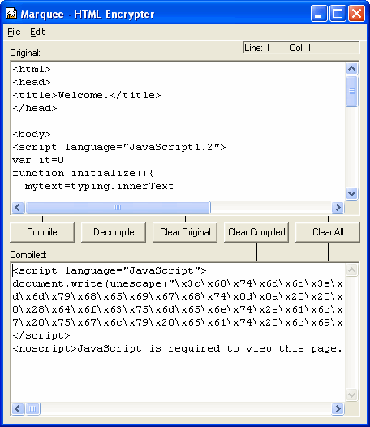



## HTML Encrypter

### Description

Today, there are many online thieves. Fortunately, this is one of those answers to security. This program can encrypt your source code and therefore making it harder for online thieves to steal your code. As you can see in the screenshot, all the characters are converted into hexadecimal codes. If you lost your original file or your original source code, you can decompile the hexadecimal codes to the original source code. Some browsers may not have JavaScript support or others have JavaScript disabled, so the encrypted page cannot be displayed. That is why I added "<noscript>JavaScript is required to view this page.</noscript>" after the encrypted source code.
 
### More Info
 

             |
---                |---
**Submitted On**   |2004-07-20 14:29:24
**By**             |[mathXpert](https://github.com/Planet-Source-Code/PSCIndex/blob/master/ByAuthor/mathxpert.md)
**Level**          |Intermediate
**User Rating**    |3.7 (22 globes from 6 users)
**Compatibility**  |VB 6\.0
**Category**       |[Internet/ HTML](https://github.com/Planet-Source-Code/PSCIndex/blob/master/ByCategory/internet-html__1-34.md)
**World**          |[Visual Basic](https://github.com/Planet-Source-Code/PSCIndex/blob/master/ByWorld/visual-basic.md)
**Archive File**   |[HTML\_Encry1772037202004\.zip](https://github.com/Planet-Source-Code/mathxpert-html-encrypter__1-55034/archive/master.zip)

